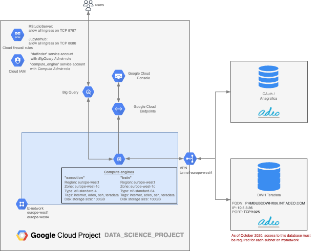

# Terraform for Data Science

In this folder we collect the Terraform configurations to set up a GCP project for data science activities
In particular, the schema of the project created with these instructions is the following:

The script creates the instances and creates service accounts with required permissions.

The Terraform state is stored in a Google Cloud Storage bucket whose name is always formed by the project-id with the postfix `-terraform`.
This bucket is automatically locked and encrypted and only project owners can access it.
## Requirements
### Software

* Terraform >= 0.12.4
* Gcloud cli

### Usage

While initializing the repo, you set up the standard configurations for the project's architecture. There are described in the `backend.tf` and `vars.tf` files and can be modfied according to project's need. In particular values for variable NETWORK and SUBNET should be set in the `vars.tf` file to define the networks associated to created instances.